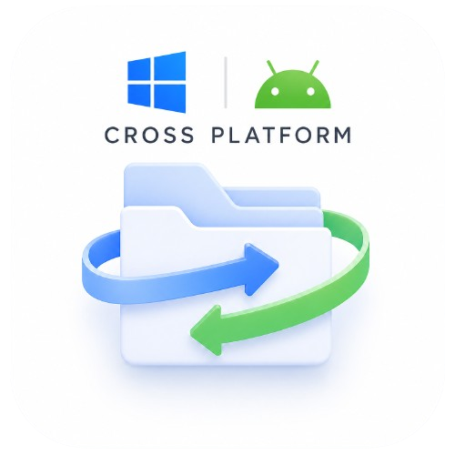

<div align="center">
  
  <h1>Quick Drop</h1>
  <p><b>The fastest, most secure, and simplest way to share files.</b></p>
  
  <p>
    
  </p>
</div>

---

**Quick Drop** was built because every other file-sharing app is either too slow, forces you through cloud servers, has file size limits, or uses weak security. 

Quick Drop is a fast, offline peer-to-peer file sharing application for Windows and Android. It transfers files directly over your local network, bypassing the internet entirely.

## Features

- **No Size Limits:** Transfer files or deep folder structures of any size.
- **Fast Local Transfers:** Maximize your hardware's throughput. Easily hit ***150+ MB/s*** on standard Wi-Fi, with speeds scaling further on Gigabit Ethernet setups.
- **Zero Configuration:** Devices automatically discover each other on the local network. No accounts or pairing codes required.
- **Cross-Platform:** Send between any combination of Windows and Android devices.
- **Secure:** All transfers are end-to-end encrypted locally using XChaCha20-Poly1305 and X25519.

## Installation

1. Grab `QuickDrop.exe` from the [Releases](https://github.com/karnyadavdev/Quick-Drop/releases) tab.
2. Run the installer.
3. Open the app on devices connected to the same Wi-Fi (also supports devices connected over an Ethernet network, for example, office/college PCs).
4. Start transferring!
   
## How It Works Under The Hood

Quick Drop is built with Flutter and uses native network sockets for high-speed I/O.

- **Discovery:** UDP Broadcast to find local peers.
- **Handshake:** ECDH key exchange to establish trust.
- **Key Derivation:** HKDF to generate the session secret.
- **Verification:** Both screens display a 6-digit cryptographic PIN to prevent Man-In-The-Middle (MITM) attacks.
- **Streaming:** Files are chunked into 64KB blocks, encrypted on the fly, and streamed directly to disk.

### Building from Source

Requirements: Flutter SDK (Windows), Visual Studio Build Tools.

```bash
flutter build windows
```

To run multiple instances on the same PC for testing, enable UDP Port sharing:
```bash
flutter run -d windows --dart-define=QUICKDROP_ALLOW_SAME_PC=true
```

## License
MIT License
